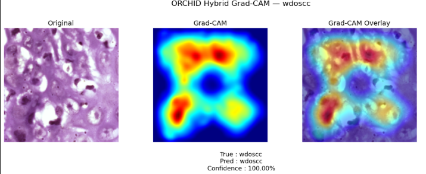

# 🧬 ORAL AI — AI-Based Oral Histopathology Analysis

> **A Computer Vision and Deep Learning framework for five-class oral histopathology classification using Swin Transformer, CLIP-guided semantic fusion, and Explainable AI.**

[](https://www.python.org/)
[](https://pytorch.org/)
[](#)
[](#)
[](#)
[](#)

---

## 📌 Overview

**ORAL AI** is a research-oriented Computer Vision system developed during my internship at the **International Center for Chemical and Biological Sciences (ICCBS)**.

The project explores the application of modern Deep Learning and Vision Transformer architectures to **oral histopathology image classification**.

The primary objective was to develop a model capable of learning discriminative visual patterns from histopathological images and classifying them into **five oral histopathology categories**, while also providing visual explanations for its predictions.

The project covers the complete AI workflow:

**Data → Preprocessing → Model Development → Experimentation → Evaluation → Explainability → Deployment**

What initially began as a research problem evolved into an end-to-end AI project involving both experimental research and practical implementation.

---

## 🎯 Motivation

Medical imaging presents a particularly challenging Computer Vision problem.

Unlike many conventional image classification tasks, histopathological images contain complex biological structures, subtle visual differences, considerable variation in tissue morphology, and changes caused by staining and image acquisition.

In oral histopathology, visually similar patterns may correspond to significantly different pathological conditions.

This creates several challenges:

* Subtle inter-class differences
* High intra-class variation
* Complex tissue structures
* Staining and illumination variation
* Fine-grained visual patterns
* Large and information-dense histopathological images
* Need for reliable model interpretation

Therefore, high classification accuracy alone is not sufficient. Understanding **why a model reaches a particular prediction** is also important, especially in medical imaging research.

This motivated the incorporation of **Explainable AI through Grad-CAM** alongside the classification pipeline.

---

# 🧠 Model Architecture

The final architecture combines visual representation learning with semantic guidance.

### High-Level Architecture

```text
                    Input Histopathology Image
                              │
                              ▼
                    ┌───────────────────┐
                    │  Image Processing │
                    │  & Augmentation   │
                    └─────────┬─────────┘
                              │
                              ▼
                    ┌───────────────────┐
                    │  Swin Transformer │
                    │  Visual Backbone  │
                    └─────────┬─────────┘
                              │
                    Multi-Stage Features
                              │
                              ▼
                    ┌───────────────────┐
                    │ CLIP Semantic     │
                    │ Guidance          │
                    └─────────┬─────────┘
                              │
                              ▼
                    ┌───────────────────┐
                    │ Multi-Stage       │
                    │ Cross-Attention   │
                    └─────────┬─────────┘
                              │
                              ▼
                    ┌───────────────────┐
                    │ Feature Fusion    │
                    └─────────┬─────────┘
                              │
                              ▼
                    ┌───────────────────┐
                    │ U-Net Inspired    │
                    │ Decoder           │
                    └─────────┬─────────┘
                              │
                              ▼
                    ┌───────────────────┐
                    │ 5-Class           │
                    │ Classification    │
                    └───────────────────┘
                              │
                              ▼
                         Prediction
                              │
                              ▼
                         Grad-CAM
```

---

## 🔬 Core Components

### 1. Swin Transformer

The **Swin Transformer** serves as the primary visual backbone.

It provides hierarchical visual representations and enables the model to capture both local and broader contextual information from histopathological images.

The multi-stage structure is particularly useful for medical images where meaningful patterns can exist at different spatial scales.

---

### 2. CLIP Semantic Guidance

**CLIP** is incorporated to introduce semantic information into the visual learning process.

Rather than relying solely on image features, the architecture explores the interaction between visual representations and semantic information.

This provides additional guidance for distinguishing visually similar pathological classes.

---

### 3. Multi-Stage Cross-Attention

Cross-attention is used to allow information from different representations to interact.

The multi-stage design enables semantic information to influence visual representations at different levels of the feature hierarchy.

This was an important part of the experimentation process and the final architecture.

---

### 4. Feature Fusion

The architecture combines complementary representations through multi-stage feature fusion.

The objective is to preserve useful information from different feature levels while producing a stronger representation for classification.

---

### 5. U-Net-Inspired Decoder

A U-Net-inspired decoder is incorporated to progressively refine and combine feature representations.

Although the primary task is classification, the decoder structure provides a mechanism for retaining richer spatial information within the architecture.

---

### 6. Explainable AI — Grad-CAM

To improve interpretability, **Grad-CAM (Gradient-weighted Class Activation Mapping)** was incorporated into the pipeline.

Grad-CAM generates a visual heatmap highlighting image regions that contributed most strongly to a model prediction.

This allows us to move beyond:

> **"What did the model predict?"**

toward:

> **"Which regions influenced the model's prediction?"**

This is particularly important in medical imaging research, where interpretability can provide additional insight into model behavior.

---

# 🧪 Five-Class Classification

The final system performs classification across five oral histopathology categories:

| Class      | Description                                            |
| ---------- | ------------------------------------------------------ |
| **MDOSCC** | Moderately Differentiated Oral Squamous Cell Carcinoma |
| **NORMAL** | Normal Oral Tissue                                     |
| **OSMF**   | Oral Submucous Fibrosis                                |
| **PDOSCC** | Poorly Differentiated Oral Squamous Cell Carcinoma     |
| **WDOSCC** | Well Differentiated Oral Squamous Cell Carcinoma       |

---

# 📊 Model Performance

The final model achieved the following performance on the test set:

| Metric             |     Result |
| ------------------ | ---------: |
| **Test Accuracy**  | **95.73%** |
| **Macro F1-Score** | **96.20%** |
| **Macro ROC-AUC**  | **0.9976** |

These results demonstrate the model's ability to discriminate between the five oral histopathology classes within the evaluated dataset.

> **Important:** These metrics represent experimental results on the evaluated test set and should not be interpreted as clinical validation or evidence of diagnostic performance in real-world clinical settings.

---

# 🔍 Grad-CAM Visualizations

Grad-CAM was used to investigate the visual regions influencing model predictions.


### ### Example  — Original vs Grad-CAM




> These visualizations are intended for research and interpretability analysis and should not be considered a substitute for expert pathological assessment.

---

# 🖥️ Interactive AI Application

The trained model was integrated into an interactive application that allows users to:

* Upload a histopathology image
* Generate an AI prediction
* View prediction confidence
* View class probability distribution
* Generate Grad-CAM visualizations
* Compare the original image with model attention maps

### 🚀 Live Demo

**[Launch ORAL AI →](https://ce355c1bc8e64289e6.gradio.live/)**

---

# 📂 Project Structure

```text
ICCBS-Intership-Project/
│
├── 01_Model_Training_and_Evaluation.ipynb
│
├── 02_Oral_AI_Inference_and_GradCAM.ipynb
│
├── README.md
│
└── requirements.txt
```

### Notebook 01 — Model Training & Evaluation

Contains the experimental pipeline including:

* Dataset preparation
* Image preprocessing
* Data augmentation
* Dataset splitting
* Swin Transformer configuration
* CLIP semantic guidance
* Feature extraction
* Cross-attention
* Feature fusion
* Model training
* Validation
* Test evaluation
* Performance metrics
* Five-class prediction
* Confidence estimation
* Class probability distribution
* Grad-CAM generation
* Visualization

### Notebook 02 — ORAL AI Inference & Explainability

Contains the inference and explainability pipeline including:

* Model loading
* Image preprocessing
* Five-class prediction
* Confidence estimation
* Class probability distribution
* Grad-CAM generation
* Visualization
* Interactive Gradio application

---

# 🛠️ Technologies & Tools

### Programming

* Python

### Deep Learning

* PyTorch
* Torchvision
* timm

### Computer Vision

* Image preprocessing
* Image augmentation
* Feature extraction
* Image classification
* Vision Transformers
* Attention mechanisms
* Grad-CAM

### Vision & Multimodal Models

* Swin Transformer
* CLIP

### Architecture

* Multi-stage feature extraction
* Cross-attention
* Semantic feature fusion
* U-Net-inspired decoder

### Explainable AI

* Grad-CAM

### Application

* Gradio

### Development Environment

* Kaggle / Jupyter-based experimentation

---

# 🔬 Research Contribution

This project was developed as part of my research-oriented internship at **ICCBS**.

The work explores how **semantic guidance from CLIP can be combined with hierarchical visual representations from Swin Transformer architectures** for oral histopathology classification.

The project has also laid the foundation for a **research paper** exploring CLIP-guided Swin Transformer architectures for oral histopathology.

The research focuses on:

* Computer Vision for medical imaging
* Vision Transformers
* Multimodal semantic guidance
* Cross-attention
* Feature fusion
* Explainable AI
* Oral histopathology classification

---

# 📈 Learning & Research Journey

One of the most valuable aspects of this project was the learning process itself.

I started the internship without a deep understanding of Computer Vision or histopathology. Much of the knowledge developed throughout the project came from implementing ideas, reading research papers, analyzing failures, debugging experiments, and iterating on architectural decisions.

The project provided practical exposure to the challenges involved in moving from:

```text
Research Problem
       ↓
Data
       ↓
Experimentation
       ↓
Architecture Design
       ↓
Model Training
       ↓
Evaluation
       ↓
Explainability
       ↓
Application
```
---

# ⚠️ Disclaimer

This project is intended **strictly for research and educational purposes**.

The model has **not been clinically validated** and is not intended to replace professional pathological examination, medical diagnosis, or clinical decision-making.

The reported performance represents experimental evaluation on the dataset used in this research project and should not be interpreted as clinical performance.

---

# 🧑‍🔬 Internship

**Institution:** International Center for Chemical and Biological Sciences (ICCBS)

**Project Area:** Artificial Intelligence, Computer Vision & Healthcare

**Focus:** Oral Histopathology Image Classification


---

# 📚 Research

A research paper based on this work is currently **in progress**, focusing on:

> **CLIP-Guided Swin Transformer Architectures for Oral Histopathology**

Publication details will be added here once available.

---

# 👩‍💻 Author

**Mahrukh Baig**

---

## 📜 License

This repository is intended primarily for research and educational purposes.

Please review the dataset's original licensing and usage terms before using or redistributing any associated data.

---

